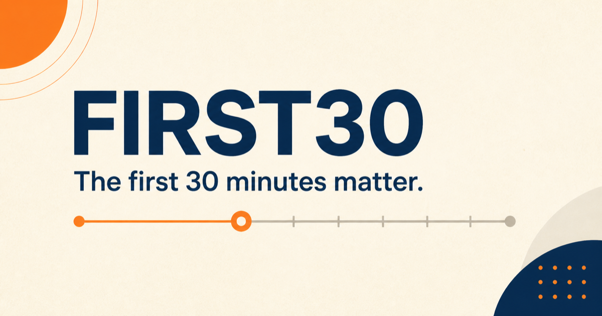

# FIRST30



FIRST30 is an end-to-end financial cyber-fraud reporting and recovery prototype built for India. It turns a confusing, high-stress reporting process into one guided journey: capture the incident, structure the evidence, submit a bilingual complaint, respond to follow-up requests, and track a simulated partial restoration.

> [!IMPORTANT]
> FIRST30 is a demonstration using synthetic people, transactions, banks, evidence and recovery events. It does not contact any bank, police department or government system. For a real financial cyber-fraud incident in India, call the national helpline at **1930**.

## What it demonstrates

- A five-step English and Hindi fraud-reporting flow
- UPI, card, bank-transfer and wallet incident capture
- Synthetic receipt upload with a safe built-in sample
- AI-assisted extraction with editable, field-level confirmation
- Factual bilingual complaint drafting without invented details
- Internal case submission with resumable progress
- A citizen-facing timeline for every case update
- Simulated bank-statement follow-up and evidence response
- A complete ₹18,499 loss-to-₹12,000 partial-restoration journey
- Responsive, keyboard-accessible controls designed to meet WCAG 2.2 AA
- No redirects to external government, police or banking portals

## Demo journey

1. Start a synthetic report and choose the fraud and payment type.
2. Use the bundled receipt or upload a synthetic image up to 5 MB.
3. Review and correct every extracted transaction field.
4. Describe the incident and generate an English/Hindi complaint.
5. Consent to the simulation and submit the report internally.
6. Provide the requested sample bank statement.
7. Confirm the masked demo account and complete the simulated restoration.

The final case records ₹12,000 as restored and ₹6,499 as remaining under simulated review.

## Technology

| Layer | Implementation |
| --- | --- |
| Application | React 19, TypeScript and Vinext |
| Runtime | Cloudflare Workers-compatible ESM |
| Database | D1-compatible SQLite with Drizzle ORM |
| Evidence storage | R2-compatible object storage |
| AI | Server-side OpenAI Responses API with deterministic fallback |
| Local environment | Docker Compose, Wrangler and OrbStack-compatible containers |
| Validation | Vitest, ESLint and production builds |

## Run with Docker and OrbStack

Requirements:

- OrbStack or another Docker-compatible runtime
- Docker Compose

Create the local environment file:

```bash
cp .env.example .env
```

Set `SESSION_SECRET` to a random value containing at least 32 characters. `OPENAI_API_KEY` is optional: the bundled sample remains deterministic without it, and unsupported evidence falls back to manual entry.

Start the development container:

```bash
docker compose up --build app
```

Open [http://localhost:3000](http://localhost:3000). Source changes reload automatically, while local D1 and R2 state persists in named Docker volumes.

To run the production-style, non-root container:

```bash
docker compose --profile production up --build app-prod
```

## Run directly with Node.js

Requirements:

- Node.js 22.13 or newer
- npm

```bash
npm ci
cp .env.example .env
npm run dev
```

The development command forces a fresh Vite dependency bundle on startup to avoid stale dynamically imported modules.

## Environment variables

| Variable | Required | Purpose |
| --- | --- | --- |
| `SESSION_SECRET` | Yes | Signs anonymous 24-hour demo sessions |
| `OPENAI_API_KEY` | No | Enables extraction for non-bundled synthetic evidence |
| `OPENAI_MODEL` | No | Overrides the configured OpenAI model |
| `FIRST30_PORT` | No | Changes the host port used by Docker Compose |

Never commit `.env` files or real evidence. The repository tracks only `.env.example`, which contains placeholders.

## Useful commands

```bash
npm test          # Run workflow and schema tests
npm run lint      # Run static analysis
npm run build     # Create the production Worker build
```

Check application and database readiness at [`/api/health`](http://localhost:3000/api/health).

## Project structure

```text
app/                 Pages and typed API routes
components/          Bilingual citizen-facing interface
db/                  D1 schema and database access
drizzle/             Versioned database migrations
lib/                 AI, contracts, server and workflow logic
public/              Public brand assets
Dockerfile           Development and production image targets
compose.yaml         Persistent local D1/R2 services
```

## Privacy and safety boundaries

- Anonymous sessions are signed and expire after 24 hours.
- Cases and evidence are scoped to their owning session.
- Uploads accept image formats only and are limited to 5 MB.
- Submission and restoration operations are idempotent.
- AI output is schema-validated and generated only from citizen-confirmed facts.
- Evidence is treated as untrusted input; the model receives no tools and storage is disabled.
- The prototype limits each session to three cases and ten AI operations.
- Secrets are injected only at runtime and are excluded from Git and container images.

## Status

FIRST30 is a hackathon prototype, not an official reporting or banking service. All post-submission coordination, held-funds states and restoration events are generated by its internal simulation.
